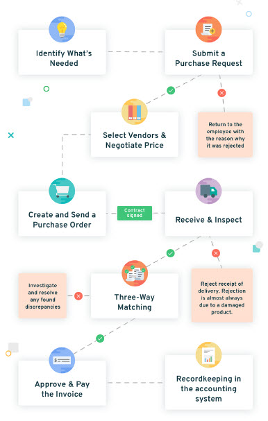

# e-pro-cure
E-Procurement System to meet the needs of automation in the internal procurement process of a company.  
## Overview
1.  The application has been developed using microservice approach.  
2.  We use git monorepo where all microservices are the modules in a single respository.
3.  Each microservice product-service and review-service can be built and run independently using Maven.
4.  Each microservice can build, test, run, dockerize, deploy & run independently using Docker, Travis and Kubernetes. It is however maintained as a mono-repo.

## Tools & Techologies
-  Spring Boot 2.6.6
-  Microservices Architecture
-  Spring Cloud Gateway
-  MySQL
-  Activiti for BPMN
-  Mockito for Testing
-  Docker

## Modules
1.  Settings, Parameters and General Setups
2.  Items/Inventory Management
3.  Purchase Requistion
4.  Purchase Order
5.  Vendor Management
6.  Bid Management
7.  Invoice Management
8.  Payment Processing

## Services
1.  [configurations-service](configurations-service/README.md)
2.  [discovery-service](discovery-service/README.md)
3.  [gateway-service](gateway-service/README.md)
4.  [setups-service](setups-service/README.md)
6.  [workflow-service](workflow-service/README.md)
7.  [notifications-service](notifications-service/README.md)
8.  [inventory-service](inventory-service/README.md)
9.  [suppliers-service](suppliers-service/README.md)
10.  [orders-service](orders-service/README.md)
11.  [invoices-service](invoices-service/README.md)
12. [payments-service](payments-service/README.md)
13. [authentication-service](authentication-service/README.md)
14. [frontend-service](ui-service/README.md)

## Starting Up

## Postman Collection
You can access the postman collection [here]()  
### Process Flow

#### Contributions
-  [Paul Gichure](https://linkedin.com/in/gichure). You can reach out at e-procure@gichure.me.ke

#### License
[MIT](LICENSE.md)

#### Disclaimer
This project is purely for learning purposes and thus it is subject to change without notice.  
Should you need a stable version,reach out at e-procure@gichure.me.ke or fork this repository. 
 I also do not offer support services as well.  
