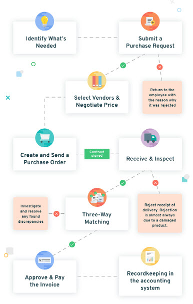

# e-pro-cure
E-Procurement System to meet the needs of automation in the internal procurement process of a company.  
## Overview
1.  The application has been developed using microservice approach.  
2.  We use git monorepo where all microservices are the modules in a single respository.
3.  Each microservice product-service and review-service can be built and run independently using Maven.
4.  Each microservice can build, test, run, dockerize, deploy & run independently using Docker, Travis and Kubernetes. It is however maintained as a mono-repo.

## Tools & Techologies
-  Spring Boot 2.6.6
-  Microservices Architecture
-  Spring Cloud Gateway
-  MySQL
-  Activiti for BPMN
-  Mockito for Testing
-  Docker

## Modules
1.  Settings, Parameters and General Setups
2.  Items/Inventory Management
3.  Purchase Requistion
4.  Purchase Order
5.  Vendor Management
6.  Bid Management
7.  Invoice Management
8.  Payment Processing

## Services
1.  configurations-service
2.  discovery-service
3.  gateway-service
4.  setups-service
5.  workflow-service
6.  inventory-service
7.  suppliers-service
8.  orders-service
9.  invoices-service
10. payments-service

## Starting Up

## Postman Collection
You can access the postman collection [here]()  
### Process Flow

#### References
-  http://eprints.binus.ac.id/36924/1/Paper1stauthorIjeter30872020.pdf
-  https://planergy.com/blog/procurement-process-cycle/
-  https://codingnconcepts.com/spring-boot/deployment-of-microservices-using-docker-and-jenkins/
-  https://github.com/ashishlahoti/springboot-microservices

#### Contributions
-  [Paul Gichure](https://linkedin.com/in/gichure)

#### License
[MIT](LICENSE.md)
